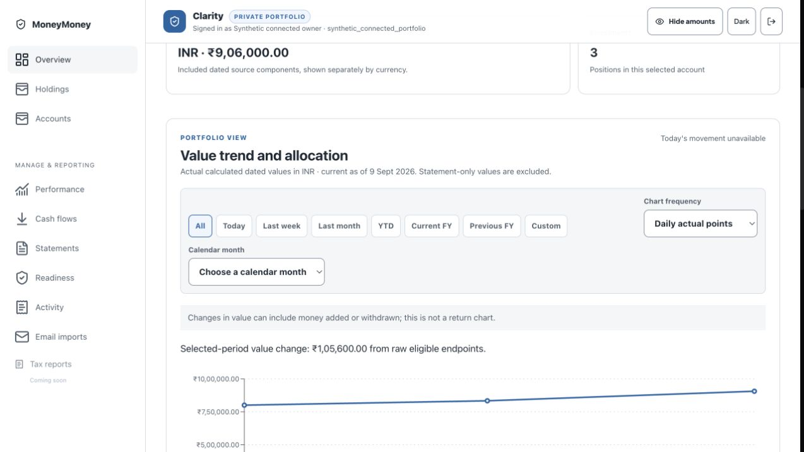
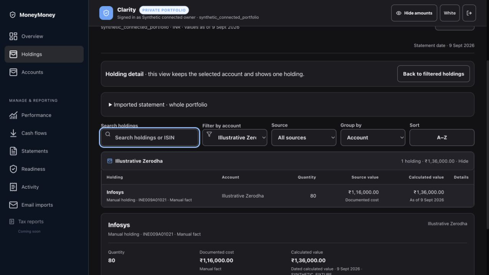
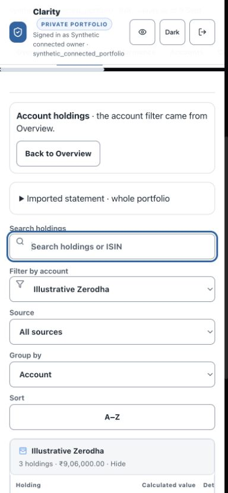

# MoneyMoney

I'm building this for my family. Our investments sit across Indian and US
accounts, statements arrive in different formats, and the person helping manage
them isn't always the person who needs to understand them.

I want one place to answer fairly ordinary questions: what do we own, what is it
worth, where did that number come from, and what have we missed? I also want my
dad to be able to use it without learning another complicated finance app.

There isn't a business plan behind this. I don't currently expect to monetise it.
I'd like it to become useful enough that other people with the same problem can
use it, change it and help improve it.

**Where it stands:** this repository contains prototype code under MIT. The newer
private version has moved further on. The screenshots below show that newer local
version with invented data; cloning this repository does **not** yet give you
that exact interface. [What needs to happen before the next code release](docs/NEXT_CODE_RELEASE.md).

The name stuck before I noticed the connection: my dad's favourite song is
ABBA's “Money, Money, Money.”

## What it looks like now

These are unedited captures from the accepted local Clarity review on
23 September 2026. All accounts and values shown are synthetic. They are working
screens, not renders, a hosted-product guarantee or evidence of real returns.

### Clarity — the regular view

White and Dark versions, a holdings table, account filters and a detail view.
The intention is a calm place to check the portfolio, with dates and source
information close to the numbers.



The chart deliberately says that a change in value is not a return. Adding money
can make the line go up without the investments having performed better.



The detail view separates documented cost from calculated value and keeps the
selected account in view.

<details>
<summary>Mobile working screen</summary>



This is a scrolled acceptance capture. Mobile still needs less filtering before
useful information comes into view; it is not a finished marketing screenshot.

</details>

## What works, and where

| Area | Current position |
| --- | --- |
| Public code | Earlier React/TypeScript frontend, Python ingestion and ledger components, financial utilities and synthetic tests. |
| Newer Clarity interface | Overview → holdings → detail accepted locally; dates, account scope and masking exercised with synthetic data. Not yet released in this checkout. |
| Statement-led portfolio work | The private version has NSDL review and portfolio flows. A statement covers named accounts and dates, not everything the family owns. |
| Schwab | Local review-only preview. Currency, ownership and the durable import contract still need resolution before saved holdings. |
| Zerodha cash statements | Narrow local reader; no portfolio-import bridge yet. |
| Return calculations | Complete dated cash-flow history is needed. A statement balance alone is not enough. Missing history stays unavailable. |
| Comfort view | An existing simpler card-based view. The next design pass is deferred; it has not received the new Clarity redesign. |
| Voice | Work in progress. Normal private Comfort Talk is unavailable. The newer local harness tests session controls with a mock, not a live financial conversation. |

## Two views for two different jobs

**Clarity** is for whoever is checking accounts, holdings and source details. It
uses a restrained blue accent, system fonts, familiar tables and White/Dark
choices. The aim is readability and enough detail to investigate a number.

**Comfort** is for someone who wants a simpler answer and fewer controls. It
started with my dad in mind: larger text, larger targets, a small number of
sections and a more direct route to the information. Making the dashboard larger
isn't enough. We still need to simplify the language, reduce decisions, make the
selected account and displayed totals unambiguous, and test it with the person
it's meant for. High contrast alone does not establish accessibility.

## Why voice is taking longer

The useful version would let someone ask about their own holdings without
navigating tables. Getting a model to speak is the easy part.

It must use the right person's accounts, know the date and source of a number,
and say when the answer is unavailable. Changing accounts, signing out or hiding
amounts must stop the old session from continuing with the old context. It also
needs a clear choice about which provider receives portfolio information.

The current local work tests cancellation, retries, stale callbacks and privacy
state with a mock. Live provider integration, microphone use, grounded financial
answers and an ordinary-user trial remain ahead. Older Gemini experiments in the
public code are not evidence that the newer Comfort voice flow is ready.

## Who this could suit

People helping manage family finances who want to inspect and adapt the software,
keep account ownership and source evidence visible, and make it easier for a parent
to understand the result. Cross-border holdings are part of the problem I'm working
on, not a claim of complete international broker support.

## Why build this when other apps exist?

The first question for me is who holds the financial picture, and what they want
to do with it. A convenient dashboard is useful. So is being able to inspect the
software, choose where it runs and keep it out of a business built around selling
financial products.

[INDmoney](https://www.indmoney.com/features) has broad tracking and investment
features. Its [privacy policy](https://www.indmoney.com/privacy-policy), checked on
25 September 2026, permits personal information to be used for marketing and
promotional communications, and describes sharing with service providers, group
companies and business partners. That is a provider-managed commercial service,
not the same arrangement as running a family tool under your own control. This
policy review does not establish that INDmoney sells personal data.

MoneyMoney's direction is a tool for understanding what the family owns, without
turning that understanding into a sales opportunity. I don't currently plan to
monetise it. I want people to be able to inspect it, adapt it and eventually run
the current version for themselves. The parent-facing view and visible source
gaps are part of the same idea: make the information useful to the family.

That makes privacy, control and a simpler family experience the reasons to choose
it. A longer integration list or an AI chat button isn't the point of difference.
Someone who shares those priorities and is comfortable with self-hosting could be
a better fit than someone looking for a ready-made investing platform.

**Where that promise stands today:** the private version uses hosted authentication
and storage. It is not wholly offline, and the latest version is not yet a portable
public release. Future voice may send selected information to a model provider;
that needs an explicit choice. Publishing inspectable code helps, but it does not
by itself prove privacy. The next release has to make the actual data flows and
self-hosting choices clear.

## Help improve it

The most useful help is specific:

- **Comfort design:** a simpler route from “what do I own?” to an understandable
  answer, with attention to low vision, language and account scope.
- **Portability:** a reproducible synthetic setup for the next release, with
  explicit configuration instead of settings inherited from my family setup.
- **Statement formats:** one named format and version, an invented fixture and
  an expected result. No real statements in issues or PRs.
- **Financial edge cases:** a small reproducible calculation case with the
  expected answer and reasoning.
- **Voice:** session and privacy design first; no keys or private audio needed.

Design proposals can start now. For code PRs, check that the target exists in this
public checkout; the newer screenshots aren't a promise that its source is here.
Please describe the proposed change in an issue before a large patch.
[Contribution guide](CONTRIBUTING.md) · [next release scope](docs/NEXT_CODE_RELEASE.md).

## Inspect the public prototype

Use a Node version supported by the pinned Vite dependency:

```sh
npm ci
npm run dev
```

Use invented data. The commands describe the earlier public snapshot; this
publication updates its story and release plan, not its deployment certification.
The repository also includes `npm run test:xirr`, `npm run test:tax`,
`npm run test:ui` and `python3 backend/tests/run_all_tests.py`.

I make the product decisions and review the results. AI coding tools write the
implementation under my direction. [MIT license](LICENSE).
