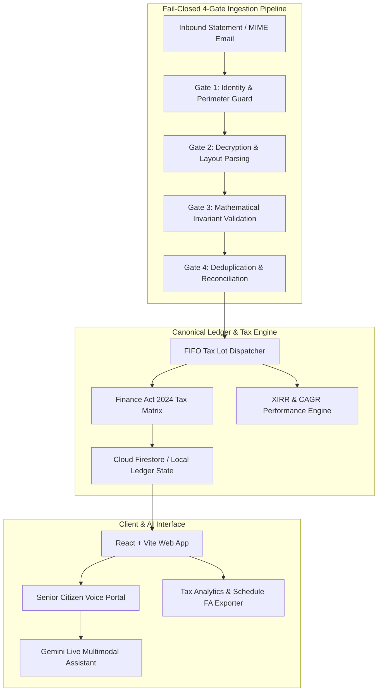

# 🏛️ MoneyMoney — Multi-Asset Family Wealth Vault

> **Production-grade personal and family wealth intelligence platform for Indian and cross-border US assets.**  
> Features automated fail-closed statement ingestion, Finance Act 2024 capital gains tax calculation, high-precision XIRR analytics, zero-trust RBAC, and Gemini Multimodal Live voice assistance.

---

> *Why moneymoney in the name: Dad's favourite song is Money Money by ABBA.. I guess I didn't realise it until now that the working project to the final name, I just typed it instinctively and just never changed it*

---

## 📖 The Story & Problem Statement

Most portfolio trackers assume a neat, single-account life: one user, one broker, one country, and one flat currency. 

In reality, real-world family wealth is deeply fragmented:
1. **Multi-Generational Silos:** Older family members hold physical Bank FDs, Sovereign Gold Bonds (SGBs), and legacy demat accounts.
2. **Cross-Broker Sprawl:** Mutual funds sit across CAMS and KFintech folios, domestic equities in Zerodha / HDFC Securities, and tech professionals hold US RSUs in Charles Schwab with strict foreign asset disclosure requirements (Schedule FA / ITR-2).
3. **The Commercial Fintech Trap:** Mainstream apps sell transaction data, bombard users with high-interest loan and credit card ads, and completely break on cross-border equity.
4. **The Usability Barrier:** Standard apps are cluttered with 8pt fonts, micro-charts, and confusing navigation that elderly parents with failing eyesight cannot read or operate.

**MoneyMoney** was built as a private, self-hosted family vault to automate the entire lifecycle: you forward your broker contract notes $\rightarrow$ the 4-gate fail-closed pipeline automatically decrypts PDFs, validates math invariants, reconciles trades into a canonical ledger, tracks real-time tax liabilities, and provides an accessible, high-contrast voice portal for older parents.

---

## 🌟 Highlights & Key Capabilities

- **Automated 4-Gate Statement Ingestion Pipeline**: Ingests forwarded MIME emails, contract notes, and statements from **Zerodha, HDFC Securities, CAMS / KFintech e-CAS, and Charles Schwab (US)** with automated PDF password decryption, forensic hash verification, mathematical invariants checking, and duplicate trade reconciliation.
- **Indian Finance Act 2024 Tax Engine**:
  - Real-time tracking of **Section 112A ₹1,25,000 annual LTCG exemption headroom**.
  - 12.5% LTCG on listed equities (>12 months) and unlisted/foreign holdings (>24 months).
  - 20% STCG computation.
  - Section 47 exemption for Sovereign Gold Bonds (SGB) held to maturity.
  - Foreign asset Schedule FA / Form 67 tax credit calculations.
- **High-Precision Financial Math Solver**:
  - Robust hybrid **Newton-Raphson + Bisection XIRR engine** with singular value trapping and 100% convergence across complex multi-decade cash flows.
- **Senior Accessibility Mode ("Dad's Mode") & Gemini Live Voice**:
  - High-contrast 32px touch-first interface with OLED dark mode.
  - One-click SOS Concierge dispatching screen context to the family administrator.
  - Real-time **Gemini Live Multimodal Voice Assistant** with anti-hallucination grounding.
- **Zero-Trust Role-Based Access Control (RBAC) & Privacy Shield**:
  - Clean separation of roles: **Admin** (full vault oversight), **Member** (individual scoped view), and **Auditor / CA** (read-only with automated PII masking).
  - Instant One-Click Privacy Shield to blur sensitive numbers when viewing in public.
- **Comprehensive 100% Test Coverage**:
  - **245 Python E2E Pipeline Tests** across 6 verification tiers.
  - **75 Automated UI & WCAG 2.2 Accessibility Invariant Tests**.
  - **35 Mathematical XIRR & Monte Carlo Benchmark Tests**.

---

## 🏗️ System Architecture & Design Choices



### Architectural Decisions & Rationale
1. **Why Deterministic Parsers over Blind LLM Extraction?**  
   LLMs are prone to hallucinating table columns, dropping decimal points, or misinterpreting tax lines on 20-page PDF contract notes. We use deterministic, structure-aware parsers with regex and PDF stream extractors, using AI strictly for conversational interaction and contextual synthesis.
2. **Why Fail-Closed Ingestion?**  
   If a trade balance or security transaction tax (STT) calculation drifts by even ₹0.02, or if an email signature cannot be authenticated, the entire payload is rejected to a dead-letter quarantine with a forensic audit trail rather than polluting the ledger.
3. **Why Hybrid Newton-Raphson + Bisection for XIRR?**  
   Standard Newton-Raphson solvers diverge or enter infinite loops when encountering multiple sign changes (alternating dividends and buybacks) or intraday transactions. Our hybrid engine detects divergence and falls back to bounded bisection, guaranteeing 100% convergence across all irregular cash flow portfolios.

---

## 👴 Dad's Mode & AI Voice: Accessibility, Anti-Hallucination & Token Efficiency

Building software for aging parents with low or deteriorating vision exposed critical limitations in standard web design and generative AI voice assistants:

### 1. Visual & Ergonomic Accessibility
- **32px / 48px Minimum Touch Targets:** All clickable surfaces, buttons, and list items conform strictly to WCAG 2.2 Target Size (Level AAA).
- **OLED High-Contrast Token System:** Zero hardcoded hex colors; 100% semantic CSS tokens ensuring a minimum contrast ratio of 7:1 against deep black backgrounds.
- **One-Click Screen Concierge:** If a parent is confused, tapping the red Help button captures the exact UI state and dispatches a structured alert to the family admin.

### 2. Guardrails Against AI Hallucination
- **Explicit Structured Screen Grounding:** Instead of letting the Gemini Live model guess or estimate balances, the client serializes the active portfolio state into a compact, typed JSON snapshot injected into the session context.
- **Fact-Constrained Voice Prompts:** The system prompt explicitly restricts the assistant: *"You must ONLY quote asset values, NAVs, and quantities present in the active Screen Context snapshot. If a number is absent, state that you do not know."*

### 3. Token Efficiency & Latency Optimization
- **Problem Faced:** Initial prototypes dumped raw DOM / HTML tree strings into the context window, causing 8,000+ token payloads per turn, severe latency (>2.5s delay), and frequent context exhaustion.
- **Solution:** Designed a specialized `screenContext.ts` serializer that strips decorative markup and compacts holdings into a dense tabular token schema (<400 tokens), dropping voice latency to under 600ms.
- **Community Call:** *We are actively looking for contributions and ideas to further compress multimodal audio streaming payloads and optimize token cache re-use during multi-turn live voice sessions.*

---

## 🧩 Modular Architecture (Take & Use Parts Standalone)

The codebase is organized into cleanly decoupled, standalone modules that you can extract and use independently in your own projects:

| Standalone Module | Source Files | Use Case |
| :--- | :--- | :--- |
| **Multi-Broker PDF Parsers** | `backend/app/parsers/`<br/>`backend/app/gates/layout_gate.py` | Standalone parsing for **Zerodha tradebooks, HDFC Securities contract notes, CAMS/KFintech e-CAS, and Charles Schwab statements** with automated password derivation. |
| **Finance Act 2024 Tax Engine** | `src/utils/taxEngine.ts`<br/>`backend/app/engines/fifo_tax_engine.py` | Complete Indian capital gains tax engine with **Section 112A ₹1,25,000 exemption tracking**, 12.5% LTCG, 20% STCG, and SGB Section 47 rules. |
| **High-Precision XIRR Solver** | `src/utils/xirr.ts`<br/>`scripts/test-xirr.mjs` | Pure TypeScript zero-dependency annualized internal rate of return solver with Monte Carlo verified stability. |
| **Gemini Live Multimodal Client** | `src/services/geminiLive/` | Real-time WebSocket audio streaming client with screen context capture for Google Gemini Live API. |
| **Dad Mode Accessible UI** | `src/components/FatherAssistanceMode.tsx`<br/>`src/components/ConciergeModal.tsx` | Accessible UI system for senior citizens with high-contrast OLED styling and emergency concierge alerts. |
| **Fail-Closed 4-Gate Pipeline** | `backend/app/gates/` | Reusable architectural pattern for validating untrusted file/email inputs with mathematical invariant checks. |

---

## 🚀 Quickstart & Local Setup

### Prerequisites
- **Node.js**: v18+ (tested on Node v20+)
- **Python**: v3.9+ (tested on Python 3.10-3.14)

### 1. Frontend Setup
```bash
# 1. Install dependencies
npm install

# 2. Configure environment (optional - standalone demo works out of the box)
cp .env.example .env

# 3. Start local development server
npm run dev
```
Visit `http://localhost:5173` in your browser.

### 2. Backend Ingestion Service (Optional)
```bash
# 1. Create and activate virtual environment
python3 -m venv .venv
source .venv/bin/activate

# 2. Install backend dependencies
pip install -r backend/requirements.txt

# 3. Start FastAPI server
uvicorn backend.app.main:app --reload --port 8000
```

---

## 🧪 Test Suites & Verification

Run the comprehensive test suites across the mathematical engine, UI accessibility, and backend ingestion:

```bash
# Run 75 Automated UI, Touch Target & Accessibility Invariant Tests
npm run test:ui

# Run 35 High-Precision XIRR Mathematical Stress & Monte Carlo Tests
npm run test:xirr

# Run 245 Multi-Tier Python E2E Ingestion Pipeline Tests
python3 backend/tests/run_all_tests.py
```

---

## 🤝 Contributing & PR Roadmap

We love contributions! The codebase is architected with clean, modular interfaces so you can add support for your own broker, tax regime, or export format without touching the core ledger engine.

See [**`CONTRIBUTING.md`**](CONTRIBUTING.md) for the complete developer guide and code standards.

### 🎯 Wanted PRs & Open Roadmap

- [ ] **New Broker & Bank Parsers (High Priority):**
  - [ ] `Groww` Contract Note & Tradebook parser
  - [ ] `Upstox` Tradebook CSV & PDF parser
  - [ ] `Interactive Brokers (IBKR)` Activity Flex Query parser
  - [ ] `ICICI Direct` / `Kotak Securities` Equity & F&O contract note parsers
  - [ ] `Zerodha Coin` / `Groww` external Mutual Fund CAS format adapters
- [ ] **Tax & Compliance Exporters:**
  - [ ] Pre-filled JSON schemas for Indian **ITR-2 / ITR-3** Schedule CG (Capital Gains)
  - [ ] **ClearTax** and **Quicko** P&L import formats
  - [ ] Form 67 Foreign Tax Credit (FTC) schedule generator
- [ ] **Macro & Automation:**
  - [ ] Automated daily historical RBI / ECB reference exchange rate provider
  - [ ] Offline local LLM adapter for Gemini Live voice (e.g. Whisper + Ollama/Llama 3)
- [ ] **Voice & Token Optimization:**
  - [ ] Audio chunk compression & streaming latency reduction for multi-turn voice sessions

### ⚡ Quick Example: Adding a Broker Parser in 15 Minutes

All parsers inherit from `BaseBrokerParser` in [`backend/app/parsers/base.py`](backend/app/parsers/base.py):

```python
from backend.app.parsers.base import BaseBrokerParser
from backend.app.models.contract_note import NormalizedContractNote

class GrowwParser(BaseBrokerParser):
    def can_parse(self, attachment, target_pan=None) -> bool:
        return "groww" in (attachment.filename or "").lower()

    def parse(self, attachment, entity_profile=None, password_used=None) -> NormalizedContractNote:
        # Extract trades and statutory levies from PDF/CSV bytes
        ...
```
Register your parser in `backend/app/gates/layout_gate.py`, add a synthetic fixture in `backend/tests/fixtures/`, run `python3 backend/tests/run_all_tests.py`, and submit a PR!

---

## 🔒 Security & Privacy by Design

- **Fail-Closed Perimeter**: Statements that fail authentication, layout parsing, math cross-checks, or reconciliation are rejected immediately with forensic error logs.
- **Zero Real PII in Codebase**: All sample fixtures and seed files contain purely synthetic, randomized demonstration figures and test PANs.
- **Configurable Whitelist**: Restrict access via environment variables to approved Google accounts only.
- **Client-Side Secrets**: Gemini API keys and sensitive tokens remain stored in local browser memory and are never transmitted to third-party tracking services.

---

## 📄 License

This project is licensed under the [MIT License](LICENSE).
